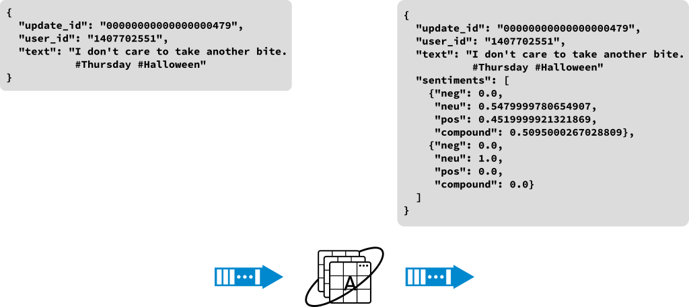

# Composable microservices for streaming analytics code supplement

This repository contains code samples used in the presenation for devconf.cz
2019 edition.

## Example: Data filtering


In this example you will deploy Apache Kafka, a random number generator,
Apache Spark, a service to filter out all the even numbers, and a service to
monitor the topic the output.

### Prerequisites

* Access to an OpenShift cluster.

* The OpenShift client(`oc`) available in a terminal session, with an active
  login to the OpenShift cluster.

### Procedure

1. Create a new project for your work. For this documentation the name of the
   project will be `myproject`, you may choose any value for the project name.
   ```bash
   oc new-project myproject
   ```
1. Install Apache Kafka into the project. For Kafka you will use the
   [Strimzi project](https://strimzi.io). The 0.1.0 version is
   chosen here for its ease of deployment with basic access to OpenShift.
   *Note: this process may take a few minutes to complete, you might see
   warnings or errors from OpenShift during the process.*
   ```bash
   oc create -f https://raw.githubusercontent.com/strimzi/strimzi-kafka-operator/0.1.0/kafka-inmemory/resources/openshift-template.yaml
   oc new-app strimzi
   ```
1. Install the radanalytics.io manifest. The
   [radanalytics.io community](https://radanalytics.io) contains several
   projects focused on deploying Apache Spark in OpenShift. This manifest
   will enable those projects in OpenShift.
   ```bash
   oc create -f https://radanalytics.io/resources.yaml
   ```
1. Deploy the number generator service. This command will deploy the service
   that will generate messages on Kafka.
   ```bash
   oc new-app centos/python-36-centos7~https://github.com/elmiko/devconf.cz-2019-composable-microservices \
     --context-dir=number-generator \
     -e KAFKA_BROKERS=kafka:9092 \
     -e KAFKA_TOPIC=numbers \
     --name=generator
   ```
1. Deploy the filtering service. This command will deploy the service to
   filter out even numbers and broadcast them to a new topic, it will also
   automatically deploy an Apache Spark cluster bound to the service.
   ```bash
   oc new-app --template=oshinko-python36-spark-build-dc \
     -p APPLICATION_NAME=evens-filter \
     -p GIT_URI=https://gitlab.com/bones-brigade/kafka-spark-python.git \
     -e KAFKA_BROKERS=kafka:9092 \
     -e KAFKA_IN_TOPIC=numbers \
     -e KAFKA_OUT_TOPIC=evens \
     -p SPARK_OPTIONS='--packages=org.apache.spark:spark-sql-kafka-0-10_2.11:2.3.0' \
     -e USER_FUNCTION_URI='https://raw.githubusercontent.com/elmiko/devconf.cz-2019-composable-microservices/master/evens-filter/filter.py'
   ```
1. Deploy listening service to monitor the output topic. This service will
   print messages from the specified topic to its logs. You can monitor the
   stream activity by following those logs.
   ```bash
   oc new-app centos/python-36-centos7~https://gitlab.com/bones-brigade/kafka-python-listener.git \
     -e KAFKA_BROKERS=kafka:9092 \
     -e KAFKA_TOPIC=evens \
     --name=listener
   ```
1. Follow the logs of the listener. You should now see a stream of even
   numbers listed in the logs of the listener.
   ```bash
   oc logs -f dc/listener
   ```

### Experiments

* Change the listener service to watch the topic that the number generator is
  broadcasting on by changing the `KAFKA_TOPIC` variable. This will give you
  a window into the source data that is being generated.
* Deploy an odd number filtering service by changing the `USER_FUNCTION_URI`
  to utilize the `odds-filter/filter.py` file. You should also change the
  `KAFKA_OUT_TOPIC` and `--name` argument to ensure they don't clash with
  your evens service.

## Example: Data transformation



In this example you will deploy Apache Kafka, a random social media update
generator, Apache Spark, a service to add sentiment analysis metadata to the
updates, and a service to monitor the output.

### Prerequisites

* Access to an OpenShift cluster.

* The OpenShift client(`oc`) available in a terminal session, with an active
  login to the OpenShift cluster.

### Procedure

1. Create a new project for your work. For this documentation the name of the
   project will be `myproject`, you may choose any value for the project name.
   ```bash
   oc new-project myproject
   ```
1. Install Apache Kafka into the project. For Kafka you will use the
   [Strimzi project](https://strimzi.io). The 0.1.0 version is
   chosen here for its ease of deployment with basic access to OpenShift.
   *Note: this process may take a few minutes to complete, you might see
   warnings or errors from OpenShift during the process.*
   ```bash
   oc create -f https://raw.githubusercontent.com/strimzi/strimzi-kafka-operator/0.1.0/kafka-inmemory/resources/openshift-template.yaml
   oc new-app strimzi
   ```
1. Install the Apache Spark and application template manifest. This manifest
   file contains templates and Spark images that are customized to
   perform the necessary language sentiment analysis. For more information
   please see
   [its documentation](https://github.com/radanalyticsio/streaming-lab).
   ```bash
   oc create -f https://raw.githubusercontent.com/radanalyticsio/streaming-lab/master/resources.yaml
   ```
1. Deploy the social media update generator. This command will deploy the
   service, please note that the application will generate the Markov chains
   necessary for creating the synthetic social media data and may take a
   few minutes to start publishing data.
   ```bash
   oc new-app centos/python-36-centos7~https://github.com/radanalyticsio/streaming-lab/ \
     --context-dir=update-generator \
     -e KAFKA_BROKERS=kafka:9092 \
     -e KAFKA_TOPIC=updates \
     -e RATE=1 \
     --name=generator
   ```
1. Deploy the transformation service. This command will deploy the service
   that will apply sentiment analysis metadata to the updates. It will also
   automatically deploy an Apache Spark cluster bound to the service.
   ```bash
   oc new-app --template=oshinko-python-spark-build-dc \
     -p APPLICATION_NAME=transformer \
     -p GIT_URI=https://github.com/radanalyticsio/streaming-lab \
     -p CONTEXT_DIR=update-transformer \
     -e KAFKA_BROKERS=kafka:9092 \
     -e KAFKA_IN_TOPIC=updates \
     -e KAFKA_OUT_TOPIC=sentiments
   ```
1. Deploy listening service to monitor the output topic. This service will
   print messages from the specified topic to its logs. You can monitor the
   stream activity by following those logs.
   ```bash
   oc new-app centos/python-36-centos7~https://gitlab.com/bones-brigade/kafka-python-listener.git \
     -e KAFKA_BROKERS=kafka:9092 \
     -e KAFKA_TOPIC=sentiments \
     --name=listener
   ```
1. Follow the logs of the listener. You should now see a stream of synthetic
   social media update messages listed in the logs of the listener. Notice
   that the `sentiments` key added to each message is being generated by
   the transformation service.
   ```bash
   oc logs -f dc/listener
   ```

### Experiments

* Change the listener service to watch the topic that the social media update
  generator is broadcasting on by changing the `KAFKA_TOPIC` variable. This
  will give you a window into how the source data differs from the transformed
  data.

